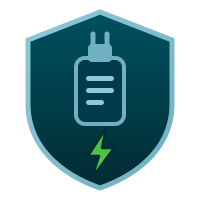

<div align="center">



# ProtegeWX

**Seu dongle para de falar com o mundo. Sua internet continua funcionando.**

Isola da rede os dongles **Sentinel HL** e os programas **PC SOFT**
(WINDEV · WEBDEV · WINDEV Mobile) — sem tirar a máquina da internet.

[](#)
[](#)
[](#)
[](LICENSE)
[](#desfazendo-tudo)

</div>

---

## ⚠️ Antes de tudo, faça este teste

Abra isto no seu navegador, agora:

```
http://127.0.0.1:1947
```

Abriu? **Sem pedir senha nenhuma?**

Esse é o Admin Control Center, o painel que veio junto com o driver do seu dongle.
Dentro dele existe a opção de **desabilitar uma chave** — poucos cliques e a
licença para de funcionar.

Qualquer pessoa que sente no seu computador consegue fazer isso. Sem senha, sem
rastro. E se a porta 1947 estiver aberta na rede, nem precisa sentar: basta estar
no mesmo Wi-Fi.

É esse tipo de coisa que o ProtegeWX fecha.

---

## O que ele faz

|  | |
|---|---|
| 🔒 **Fecha a porta 1947** | O gerenciador de licenças passa a escutar só em `127.0.0.1`. Ninguém da rede alcança suas chaves. |
| 🔑 **Põe senha no painel** | O ACC deixa de abrir para qualquer um que esteja na máquina. |
| 🛡️ **Bloqueia o caminho do V2C** | Aplicar um arquivo V2C localmente é o único jeito real de desativar uma chave HL. Ele fecha essa porta. |
| 📋 **Registra e vigia** | Guarda a prova do que suas licenças contêm hoje e avisa se qualquer coisa mudar. |
| 🌐 **Corta a telemetria** | Bloqueia a saída dos atualizadores e os domínios de telemetria — sem derrubar sua internet. |

E o mais importante: **antes de executar qualquer coisa, ele mostra o comando
exato que vai rodar**, o risco e como desfazer. Nada acontece sem você confirmar.

## O que ele **NÃO** é

> Isto aqui não é ferramenta de pirataria. É o contrário disso.

- ❌ **Não** quebra, contorna ou enfraquece proteção de cópia
- ❌ **Não** emula, clona ou falsifica dongle, chave ou licença
- ❌ **Não** faz engenharia reversa de código protegido
- ❌ **Não** modifica, corrige ou redistribui binário de terceiros
- ❌ **Não** libera módulo ou recurso que você não comprou
- ❌ **Não** estende nem altera o prazo de licença nenhuma

Ele altera **configuração de rede do seu próprio sistema operacional** (firewall,
`hosts`) e opções **documentadas do próprio Sentinel**, as mesmas que existem no
painel de administração do produto.

Nada é escrito dentro do dongle. Nunca.

**Para quem é:** quem comprou licença perpétua, tem o dongle na mão, e quer
continuar dono da ferramenta que pagou.

---

## Instalação

**1.** Baixe o `ProtegeWX-Comunidade.zip` em [Releases](../../releases)

**2.** Extraia em qualquer pasta

**3.** Botão direito em `scripts\instalar.ps1` → **Executar com o PowerShell**

O instalador confere a máquina, registra o estado atual das suas licenças e cria
os atalhos. **Ele não liga nenhuma proteção sozinho** — isso é escolha sua, pelo
painel.

### Ou pela linha de comando

```powershell
protegewx.exe                    # abre o painel no navegador
protegewx.exe --status           # mostra o estado de tudo (só lê, não altera nada)
protegewx.exe --check            # compara as licenças com o registro de referência
protegewx.exe --aplicar A1,B2    # aplica ações específicas
protegewx.exe --reverter B5      # reverte ações específicas
protegewx.exe --revert-all       # desfaz tudo
```

> **Comece sempre por `--status`.** Ele apenas lê e não altera absolutamente nada.

Precisa de **administrador** (mexe em firewall e em `Program Files`). O painel
pede elevação sozinho.

---

## As quatro camadas

| Grupo | O quê | Detalhe |
|---|---|---|
| **A** | Sentinel License Manager | Escuta só em `127.0.0.1`, recusa clientes remotos, para de procurar servidores na rede, desliga broadcast, **exige senha no painel** |
| **B** | Firewall do Windows | Fecha a 1947 para a rede e impede que o licenciamento e os atualizadores saiam da máquina |
| **C** | Arquivo `hosts` | Bloqueia domínios de telemetria — camada de **reforço apenas** |
| **D** | Proteção contra V2C | Registra as licenças, guarda cópia do runtime, nega execução dos atualizadores, monitora mudanças |

### Isso não quebra o dongle

O Windows **não filtra tráfego de loopback**, e a API do WinDev fala com o serviço
em `127.0.0.1:1947`. Bloqueia-se o que sairia da máquina — nunca o que fica dentro
dela.

### Sobre o grupo C, sem enfeite

O arquivo `hosts` não aceita curinga, não impede conexão por IP direto e é
ignorado por navegador com DNS-over-HTTPS. **Quem protege de verdade é o
firewall.** O `hosts` é reforço, e o painel diz isso na cara de quem usa.

O bloqueio de `doc.pcsoft.fr` e do fórum vem **desmarcado** — quase todo mundo usa
a documentação online no dia a dia.

---

## Desfazendo tudo

```powershell
protegewx.exe --revert-all
```

Cada ação tem reversão testada, e tudo que o programa executa fica registrado em
`logs\protegewx.log` — comando, código de saída e duração.

No braço, se preferir:

```powershell
del "C:\Program Files (x86)\Common Files\Aladdin Shared\HASP\hasplm.ini"
sc stop hasplms
sc start hasplms
```
E remova do `hosts` o bloco entre `# >>> PROTEGEWX >>>` e `# <<< PROTEGEWX <<<`.
As regras de firewall são as que começam com `PROTEGEWX - `.

---

## Compilando

Só a biblioteca padrão do Go. **Sem dependências, sem compilador C.**

```powershell
winget install --id GoLang.Go -e --source winget
git clone https://github.com/cassianomansano/protegewx.git
cd protegewx
go build -o protegewx.exe ./cmd/protegewx
```

Sai um **executável único** com o painel embutido dentro — nada de pasta de
assets ao lado.

Duas variantes, por *build tag*:

```powershell
go build -o protegewx.exe ./cmd/protegewx                    # padrão
go build -tags comunidade -o protegewx.exe ./cmd/protegewx   # seriais mascarados na tela
```

A variante `comunidade` mostra os números de série como `15••••••••`, para você
poder tirar print e pedir ajuda num fórum sem expor suas chaves.

### Estrutura

```
cmd/protegewx/main.go     bootstrap, UAC, painel, linha de comando
internal/actions/         catálogo declarativo das ações  <- comece a ler aqui
internal/sentinel/        conversa com o ACC e o hasplm.ini
internal/fw/              regras de firewall
internal/hostsfile/       bloco delimitado no arquivo hosts
internal/baseline/        retrato das licenças e comparação
internal/sysexec/         execução e log de todo comando
web/  webcom/             painel embutido no executável
```

O coração é `internal/actions/registry.go`. Cada ação declara, junto do código, a
explicação do que faz, o motivo, o risco e como desfazer — o painel monta a
interface a partir disso. **A documentação é o próprio programa**, não um texto
separado que envelhece.

---

## Limites conhecidos

Ser honesto sobre isso importa mais do que parecer poderoso:

- **Não impede** quem tem acesso físico e administrativo de aplicar um V2C. A ação
  D3 dificulta, não torna impossível.
- **Não recupera** licença já desativada.
- **Não gera C2V.** Em chaves HL travadas o próprio ACC reporta `c2v=0`: só o
  fabricante, com a Vendor Key, consegue emitir. É característica da chave.
- **Bloquear atualizações significa não receber service packs.** É intencional,
  mas é uma troca — decida sabendo.
- Se sua licença exigir ativação online periódica (não é o caso das HL
  perpétuas), isolar a rede vai quebrá-la.

---

## Contribuindo

Veja [CONTRIBUTING.md](CONTRIBUTING.md).

A contribuição mais valiosa e mais fácil: **domínio novo para bloquear**. Só peço
para confirmar que ele existe de verdade antes — já removemos vários nomes
plausíveis que simplesmente não existiam.

> ⚠️ **Nunca envie `baseline/`, `logs/` ou `estado.json` num PR.** Eles contêm os
> números de série dos seus dongles e a senha do seu ACC. O `.gitignore` já
> bloqueia, mas confira.

---

<!-- CAFEZINHO -->

---

## Licença e aviso legal

Código sob licença **MIT** — veja [LICENSE](LICENSE).

Projeto **independente e não oficial**, sem qualquer vínculo, patrocínio ou
relação com a PC SOFT ou com a Thales. WINDEV, WEBDEV, PC SOFT, Sentinel e HASP
são marcas de seus respectivos titulares, citadas aqui apenas de forma descritiva
para identificar com quais produtos a ferramenta interopera.

Este software é destinado ao **titular do equipamento e da licença**. O contrato
que você assinou com o seu fornecedor continua valendo, e este programa não o
altera nem o substitui — verifique cláusulas sobre atualização e manutenção.

Fornecido **sem garantia**. Leia o que cada ação faz antes de aplicar.

Detalhes completos em **[AVISO-LEGAL.md](AVISO-LEGAL.md)**.

<div align="center">

**Feito para a comunidade mais guerreira do mundo: programadores.** 💪

*Quem escreve o sistema que faz a empresa girar merece ter certeza de que a
ferramenta que comprou continua sendo dele.*

</div>
